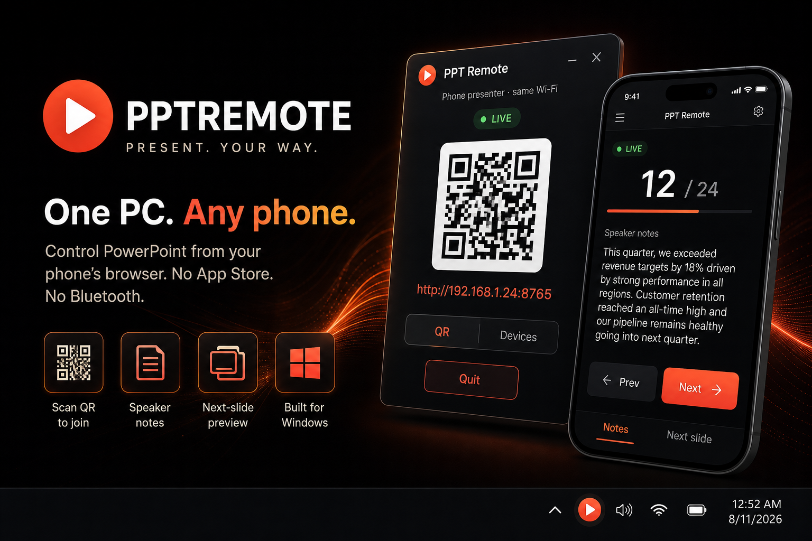

# PPTREMOTE

<p align="center">
  
</p>

<p align="center"><strong>PRESENT. YOUR WAY.</strong></p>

Control Microsoft PowerPoint from your phone’s browser. No app store, no Bluetooth. The PC runs a small tray app; the phone joins over the same Wi‑Fi (or hotspot).

Hosts a local page on port **8765** (`http://<your-pc-ip>:8765`) and talks to PowerPoint on the same machine. Traffic stays on your LAN. It does not upload the deck.

## Features

- **Phone as clicker** — Prev / Next, first / last, jump from a slide grid
- **Speaker notes** — current-slide notes on the phone, plus next-animation preview
- **Scan QR to join** — tray flyout shows the code and the LAN link
- **Local only** — same Wi‑Fi or PC hotspot; nothing leaves the room

## Download

Grab the latest Windows build from **[Releases](https://github.com/vincentperezzz/PPTRemote/releases)**.

One file. Double-click `PptRemote.exe`. Windows does not need a separate .NET install.

The first run may trigger SmartScreen or a firewall prompt. Allow it on private networks so the phone can reach the PC.

Requires **Windows 10** or **Windows 11**, plus **Microsoft PowerPoint** (desktop).

## Usage

1. Open your deck in PowerPoint.
2. PPTREMOTE lives in the **system tray**. **Left-click** the icon to open the flyout.
3. Scan the **QR** code, or type the link under it if the camera misses it.
4. Start the slideshow from the phone (or from PowerPoint).

On the phone:

- **Notes** — speaker notes for the current slide
- **Next slide** — preview the next animation, swipe to advance
- **Prev / Next** — same as clicking through animations
- Slide grid, black / white screen, first / last, exit

The tray popup shows whether a deck is open or live, which Wi‑Fi you are on, and who is connected. Hover the tray icon for status without opening the popup. Right-click → **Quit** to stop the server.

## Build from source

Requirements: [.NET 8 SDK](https://dotnet.microsoft.com/download/dotnet/8.0)

```powershell
dotnet build PptRemote/PptRemote.csproj -c Release
dotnet run --project PptRemote/PptRemote.csproj -c Release
```

Publish a self-contained exe:

```powershell
dotnet publish PptRemote/PptRemote.csproj -c Release -r win-x64 --self-contained true -p:PublishSingleFile=true -o artifacts/publish
```

## Notes

- Phone and PC must share a network (same Wi‑Fi, or the phone on the PC’s hotspot).
- PowerPoint has to be the desktop app, not the web version.
- The deck never leaves the PC. The phone only sees notes, thumbs, and controls.

## License

Use and share freely. No warranty.
